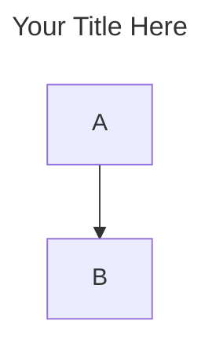

# Mermaid Diagram Guide

- You are an AI Coding Assistant tasked with generating Mermaid diagrams for markdown content.
- This guide defines the exact standards, syntax, and workflow you must follow to create clear, consistent, and visually cohesive diagrams.

---

## 1. Core Principles

- **One Slide, One Message:**
  - Each diagram must communicate exactly one key insight.
  - If a section contains multiple insights, create multiple diagrams.
- **Aggressive Simplicity:**
  - Remove any node that does not advance the narrative.
  - A slide with too much information loses the audience.
- **Diagram Independence:**
  - Each diagram must be understandable on its own.
  - Include enough context within the diagram to stand alone.
- **Consistency:**
  - Apply the same style, naming, color semantics, and structure throughout the document.
- **Coverage:**
  - Every section (H1, H2, H3, H4, H5, H6) must have at least one diagram.
  - Do not skip any content.

---

## 2. Syntax & Rules — Complete Reference

### 2.1 Code Block & Titles

- Always use triple backticks with the `mermaid` language tag.
- Add titles via frontmatter, not as a node.



### 2.2 Node Label Rules (Critical Constraints)

- **No Parentheses:**
  - Never use `()` as they break the parser.
  - Use hyphens `-` instead.
  - ❌ `"Request (data)"` ✅ `"Request - data"`
- **No Emojis/Symbols:**
  - Use plain text only in node labels.
- **Line Breaks:**
  - Use `<br/>` for multi-line labels.
  - Keep each line brief.
- **Visual Separators:**
  - Use `━━━` as a divider within a label.
  - Example: `"Title<br/>━━━<br/>Detail"`

### 2.3 Shapes & Connectors

- **Decision Nodes:**
  - Use curly braces `{}` for diamond shapes.
  - Example: `C{Valid?}`
- **Arrow Labels:**
  - Use the pipe syntax `|"text"|` after the arrow operator.
  - Example: `A -->|"calls"| B`
- **Subgraphs:**
  - Limit to 2–3 per diagram.
  - Always include a `direction` statement inside the subgraph definition.
  - Example: `direction TB`

---

## 3. Styling & Color Palette

### 3.1 Color Application Rules

- Every node must have an explicit `style` attribute.
- Use ONLY the values below — do not invent colors.
- Do not leave any node unstyled.

```css
style NodeId fill:#hexcolor,stroke:#hexcolor,stroke-width:2px
```

### 3.2 Color Palette & Semantic Usage

| Color      | Hex Fill  | Usage                            | Full Style Attribute                           |
| ---------- | --------- | -------------------------------- | ---------------------------------------------- |
| Blue       | `#e3f2fd` | Strategic / Leadership           | `fill:#e3f2fd,stroke:#0066cc,stroke-width:2px` |
| Green      | `#e5ffe5` | Operational / Execution          | `fill:#e5ffe5,stroke:#388e3c,stroke-width:2px` |
| Yellow     | `#fff9c4` | Key teams / Focus areas          | `fill:#fff9c4,stroke:#f57f17,stroke-width:2px` |
| Orange     | `#ff9f43` | Designer / Architect roles       | `fill:#ff9f43,stroke:#e67e22,stroke-width:2px` |
| Teal       | `#95e1d3` | Operator / Engineer roles        | `fill:#95e1d3,stroke:#16a085,stroke-width:2px` |
| Pink       | `#f38181` | Reliability / DevOps roles       | `fill:#f38181,stroke:#e74c3c,stroke-width:2px` |
| Red        | `#ffe5e5` | Problems / Risks / Anti-patterns | `fill:#ffe5e5,stroke:#c0392b,stroke-width:2px` |
| Light Gray | `#f5f5f5` | Background / Context nodes       | `fill:#f5f5f5,stroke:#95a5a6,stroke-width:2px` |

---

## 4. Step-by-Step Workflow

- For each markdown header section:
  1. **ANALYZE:** Identify core concepts. Decide if one or multiple diagrams are needed (minimum one per section).
  2. **CREATE:** Write the Mermaid block with frontmatter title, structure, and mandatory `style` lines for every node.
  3. **REPEAT:** Move to the next section and repeat until the document is visualized.
